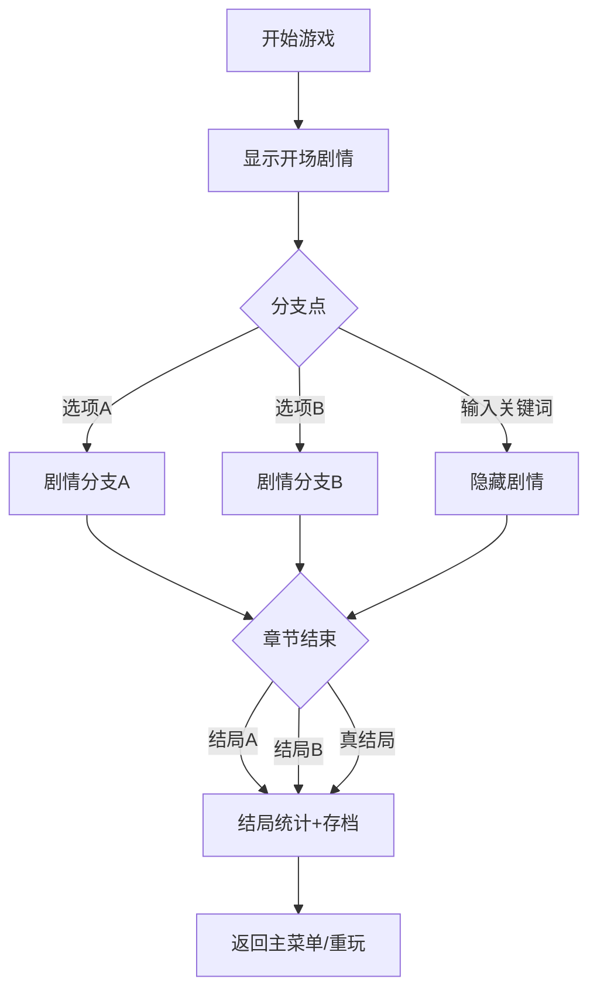

## 1. 产品概述

故障艺术（Glitch Art）打字冒险 H5 游戏是一款纯前端沉浸式文字冒险游戏，玩家通过打字输入与剧情互动，在充满故障艺术美学的赛博朋克世界中探索分支剧情，收集线索，最终走向不同的结局。

- 目标用户：喜欢文字冒险、赛博朋克、故障艺术美学的玩家
- 核心价值：通过打字交互+故障特效+多分支剧情，提供沉浸式叙事体验

## 2. 核心特性

### 2.1 功能模块
1. **文本输入模块**：打字交互、关键词检测、输入特效
2. **故障特效模块**：文字抖动、RGB色差、扫描线、画面撕裂、字符替换
3. **分支剧情模块**：多选项对话、条件判断、剧情分支跳转
4. **章节管理模块**：章节进度、存档/读档、剧情节点状态
5. **音效控制模块**：打字音效、背景氛围音、故障音效、BGM 开关
6. **结局统计模块**：多结局收集、通关数据、解锁成就

### 2.2 页面详情
| 页面名称 | 模块名称 | 功能描述 |
|-----------|-------------|---------------------|
| 开始界面 | Logo/标题 | 故障艺术标题动画、开始游戏、继续游戏、结局图鉴入口 |
| 游戏主界面 | 剧情显示 | 打字机文字显示、故障特效叠加、选项按钮 |
| 游戏主界面 | 文本输入 | 玩家输入框、关键词匹配、输入反馈特效 |
| 游戏主界面 | HUD | 章节进度、存档/读档、音效开关、菜单按钮 |
| 结局图鉴 | 统计展示 | 已解锁结局列表、解锁率、通关次数统计 |

## 3. 核心流程

## 4. 用户界面设计

### 4.1 设计风格
- **主色调**：深黑背景（#0a0a0f）、霓虹绿（#00ff41）、故障红（#ff003c）、电光蓝（#00d4ff）
- **辅助色**：暗紫（#1a0a2e）、荧光黄（#ffff00）
- **按钮风格**：无圆角矩形边框 + 霓虹光晕 + hover 抖动故障效果
- **字体**：显示字体用等宽故障风格（VT323 / Share Tech Mono），正文用 JetBrains Mono
- **布局**：终端窗口风格、扫描线叠加、CRT 屏幕圆角边框
- **动效**：文字 RGB 分离、横向撕裂、随机字符替换、屏幕闪烁

### 4.2 页面设计概述
| 页面名称 | 模块名称 | UI 元素 |
|-----------|-------------|-------------|
| 开始界面 | 标题区 | 故障抖动大标题、副标题霓虹发光、扫描线动画 |
| 开始界面 | 按钮区 | 竖向排列终端风格按钮、hover 彩色偏移 |
| 游戏主界面 | 剧情区 | 黑色终端窗口、绿色打字文字、光标闪烁、随机 glitch |
| 游戏主界面 | 选项区 | 编号选项按钮、选中反色高亮 |
| 游戏主界面 | 输入区 | 底部等宽输入框、绿色下划线、打字音效 |
| 结局图鉴 | 列表区 | 卡片式结局展示、已解锁发光、未解锁模糊锁定 |
| 结局图鉴 | 统计区 | 进度条、数字统计、成就徽章 |

### 4.3 响应式
- 桌面优先，移动端自适应
- 移动端输入框固定底部，剧情区可滚动
- 触摸优化：加大按钮点击区域

