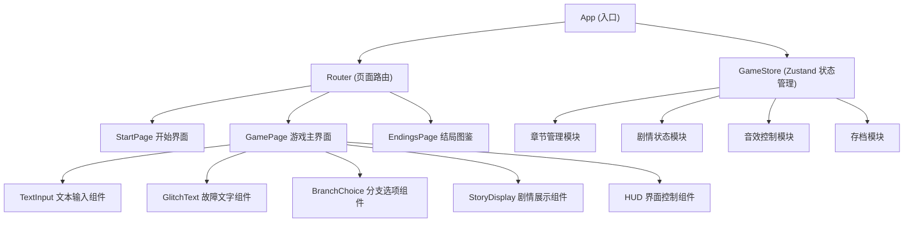

## 1. 架构设计



## 2. 技术描述
- 前端：React@18 + TypeScript + Vite@5
- 样式：TailwindCSS@3 + 自定义 CSS 动画（故障特效）
- 状态管理：Zustand
- 路由：react-router-dom@6
- 图标：lucide-react
- 音效：Web Audio API（程序化合成）
- 数据：本地 JSON 剧情包 + localStorage 存档

## 3. 目录结构
```
src/
├── components/           # 组件
│   ├── GlitchText.tsx    # 故障特效文字
│   ├── TextInput.tsx     # 文本输入
│   ├── BranchChoice.tsx  # 分支选项
│   ├── StoryDisplay.tsx  # 剧情展示
│   ├── HUD.tsx           # 界面 HUD
│   ├── Scanlines.tsx     # 扫描线叠加
│   └── TerminalWindow.tsx # 终端窗口
├── hooks/                # 自定义 hooks
│   ├── useTypewriter.ts  # 打字机效果
│   ├── useAudio.ts       # 音效控制
│   └── useGlitch.ts      # 故障特效
├── store/                # Zustand 状态
│   └── gameStore.ts      # 游戏全局状态
├── data/                 # 剧情数据包
│   ├── types.ts          # 类型定义
│   └── sampleStory.ts    # 示例剧情
├── utils/                # 工具函数
│   ├── glitch.ts         # 故障算法
│   ├── storage.ts        # 本地存储
│   └── audio.ts          # 音效合成
├── pages/                # 页面
│   ├── StartPage.tsx     # 开始页
│   ├── GamePage.tsx      # 游戏页
│   └── EndingsPage.tsx   # 结局图鉴
└── App.tsx
```

## 4. 核心数据模型

### 4.1 剧情节点类型
```typescript
interface StoryNode {
  id: string;
  text: string;           // 剧情文本
  glitchLevel?: number;   // 故障等级 0-3
  type: 'narrative' | 'choice' | 'input' | 'ending';
  choices?: Choice[];     // 分支选项
  inputKeyword?: string;  // 输入关键词（正则）
  nextId?: string;        // 下一个节点
  ending?: Ending;        // 结局信息
  effects?: Effect[];     // 特效配置
}

interface Choice {
  id: string;
  text: string;
  nextId: string;
  condition?: Condition;  // 条件判断
  setFlag?: string;       // 设置剧情标记
}
```

### 4.2 游戏状态
```typescript
interface GameState {
  currentNodeId: string;
  chapter: number;
  flags: Set<string>;      // 剧情标记
  unlockedEndings: string[];
  playHistory: HistoryEntry[];
  totalPlays: number;
}
```

## 5. 路由定义
| 路由 | 用途 |
|-------|---------|
| `/` | 开始界面 |
| `/game` | 游戏主界面 |
| `/endings` | 结局图鉴 |
